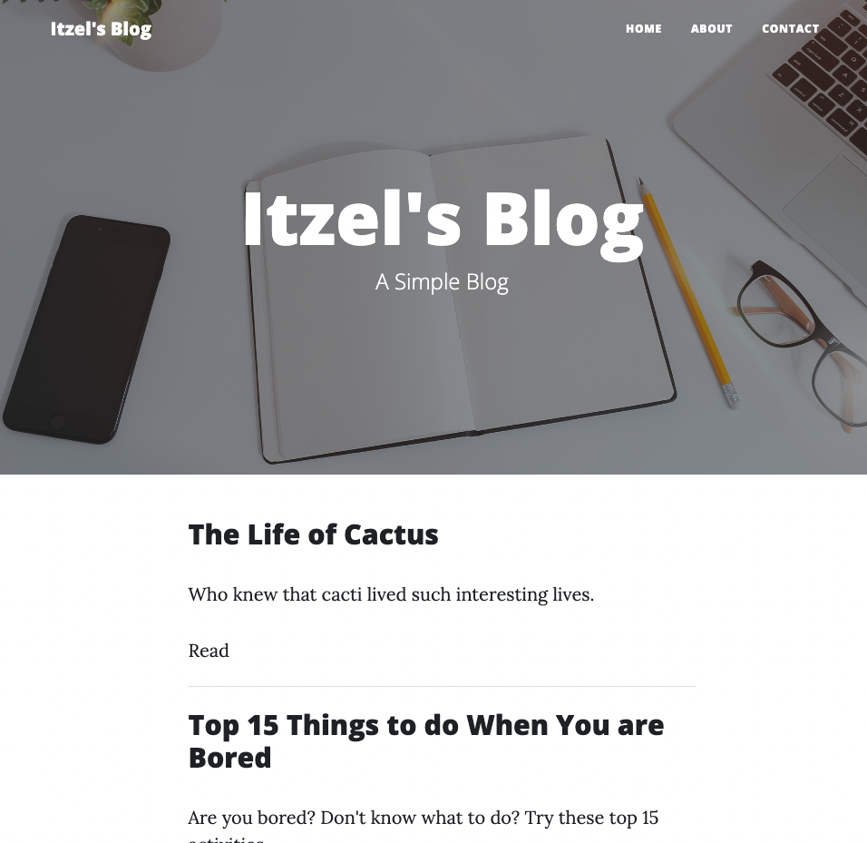
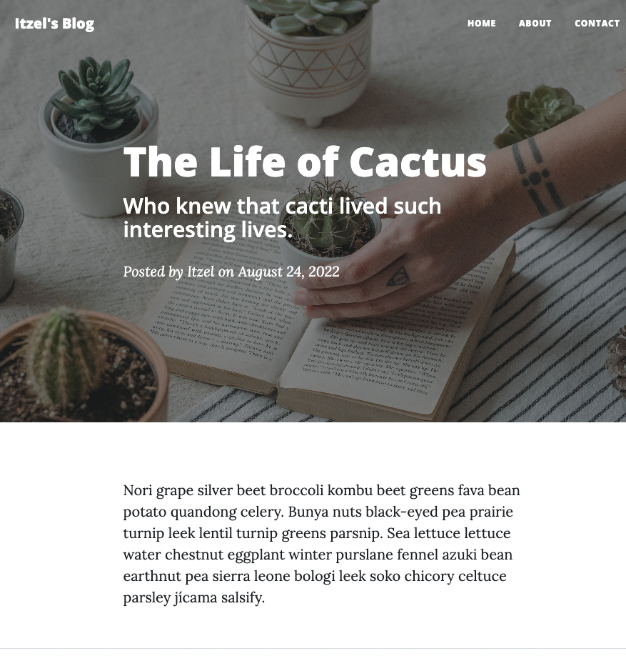

# A Simple Blog in Python

## Description

This project utilizes Flask and the Jinja templating language to render an HTML blog. The primary objective behind developing this application was to apply the skills I acquired during the "100 Days of Code in Python" course.

## Table of Contents

- [Installation](#installation)
- [Usage](#usage)
- [Credits](#credits)
- [License](#license)

## Usage

## Credits

The course was offered in [Udemy](https://www.udemy.com/course/100-days-of-code)

## License

This application is under the [MIT](https://opensource.org/licenses/MIT) license.
